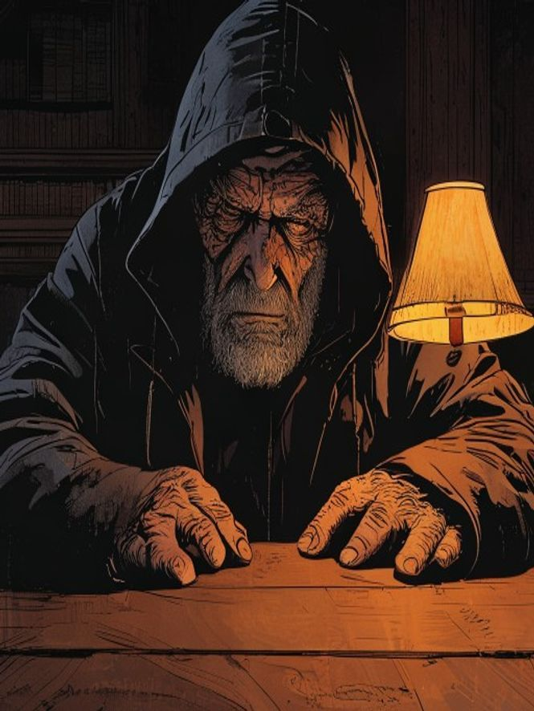
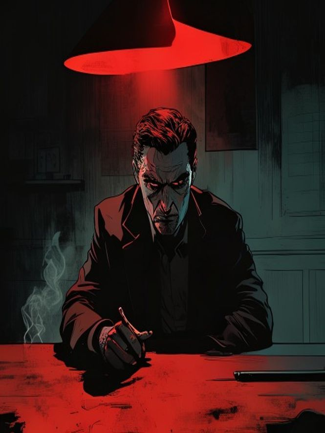
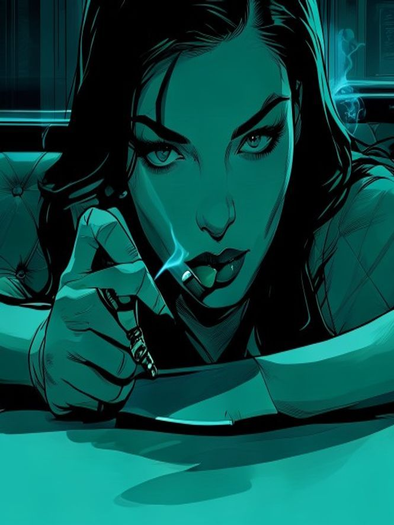

# Ink finish — corrected (crisp comic ink, not painterly)

Feedback: some first-pass samples looked watercolor/painted. Corrected to **hard, clean
comic ink** — flat cel shading, sharp edges, screenprint-crisp.

## Before → after (same character/seed)

| Painterly (first pass) | Crisp ink (corrected) |
|---|---|
|  |  |
|  |  |
|  |  |

## Per-flavor lighting (a system, not a one-off)

Each opponent owns a lighting palette; the duel screen's accent (tell chip, meters, active
angle) shifts to match — the whole screen *feels* like a different person:
red = the dangerous one, amber = the old kingpin, teal = the femme fatale, green = the fixer,
blood-red = the enforcer, and so on.
