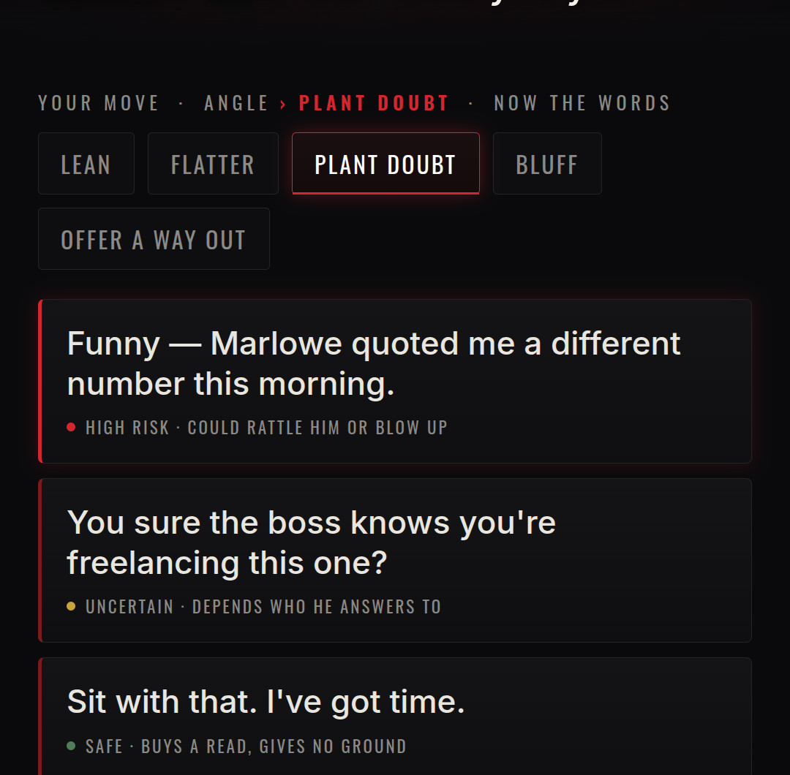
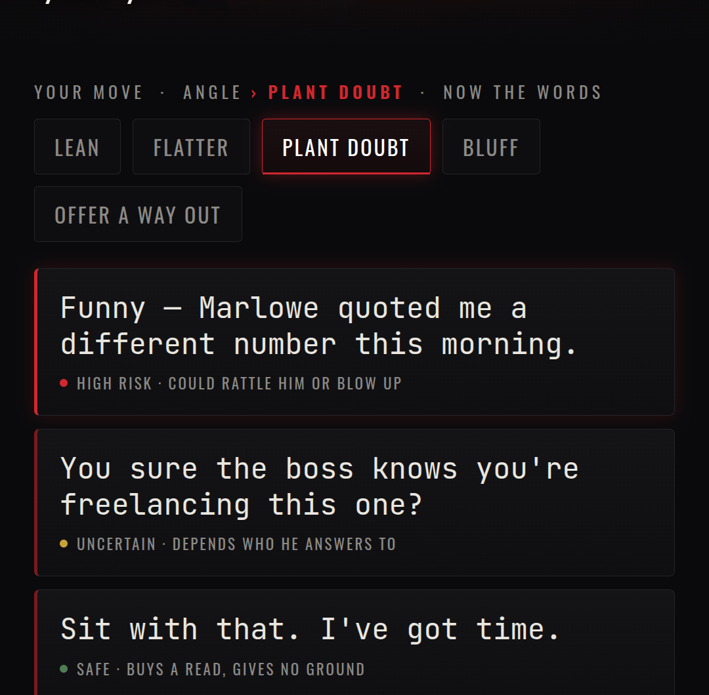
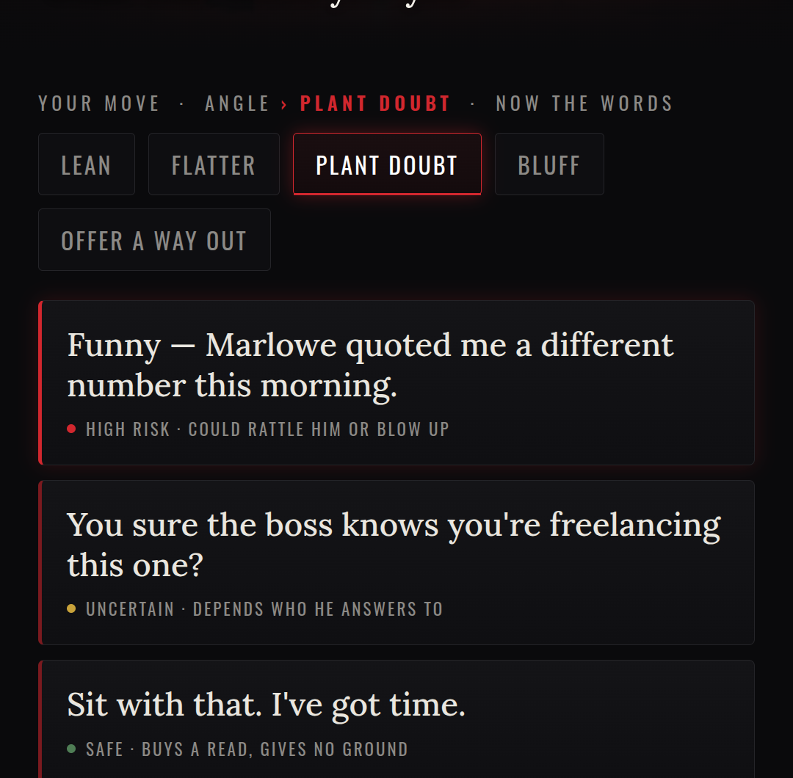

# Dialogue font — kill the cursive

The fancy italic (Playfair) is out. Three clean, non-cursive options for the spoken lines
(same duel screen, only the dialogue font changes):

## A · Sans (Inter) — modern, crisp

## B · Mono (JetBrains Mono) — typewriter / dossier, very noir-intel

## C · Serif (Lora, upright) — literary and refined, but not cursive

Pick one and it becomes the dialogue voice everywhere.
