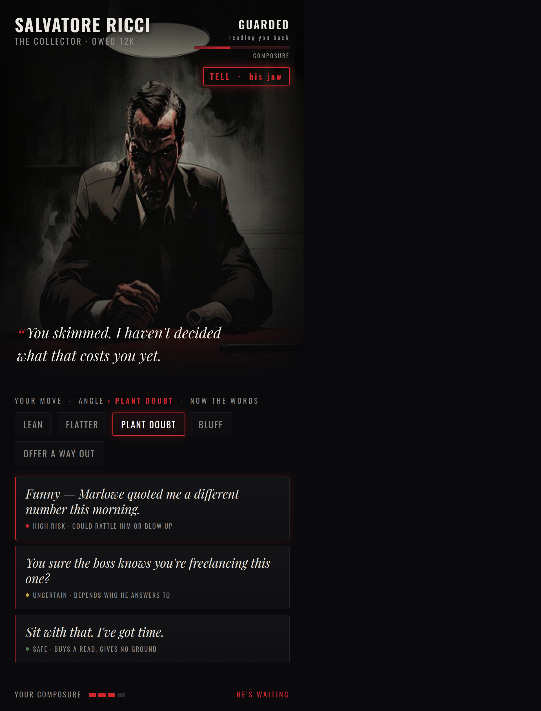
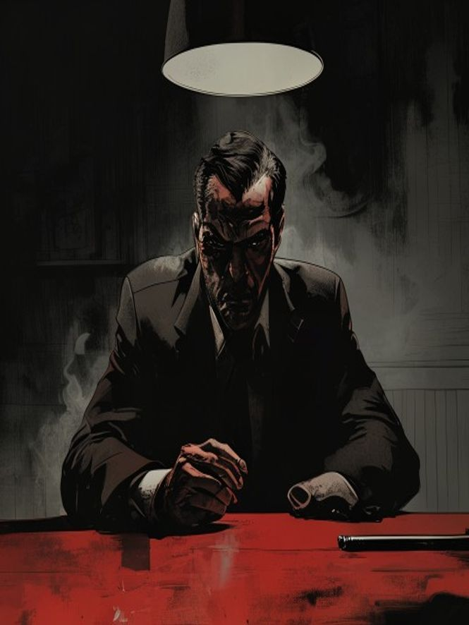
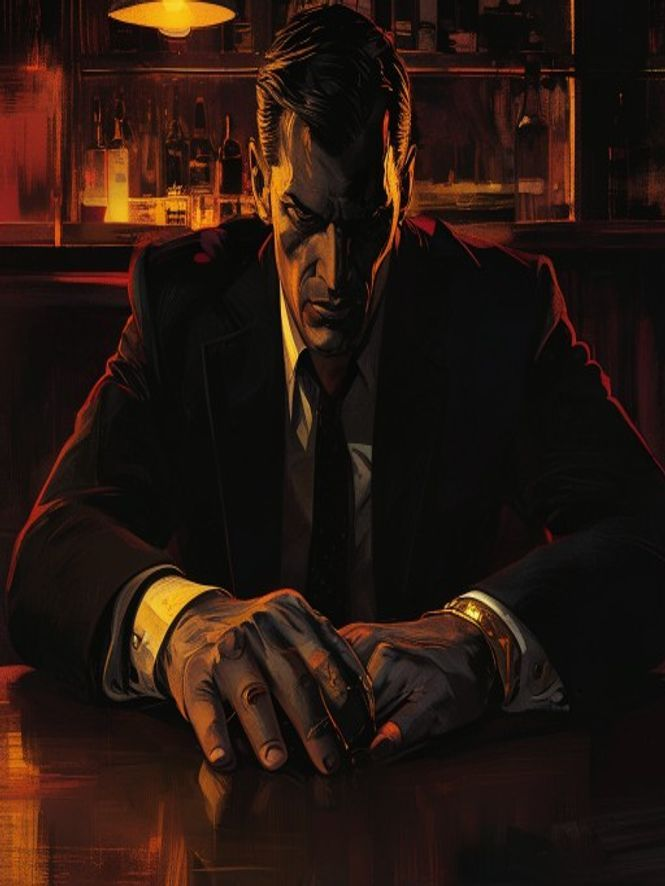
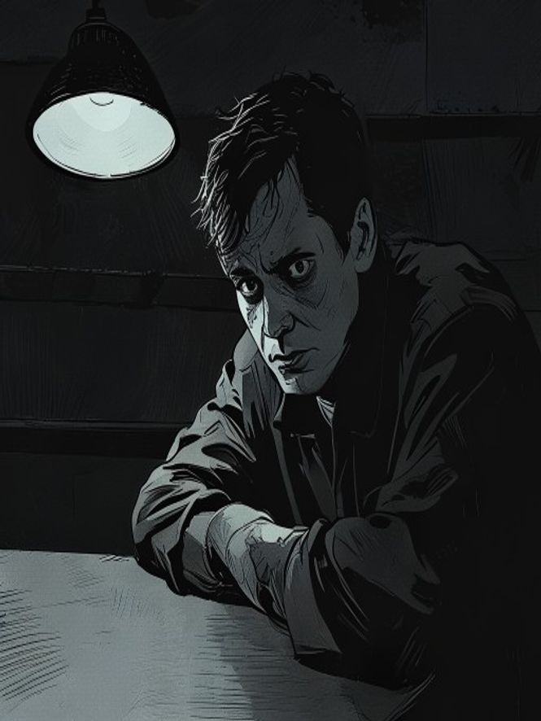
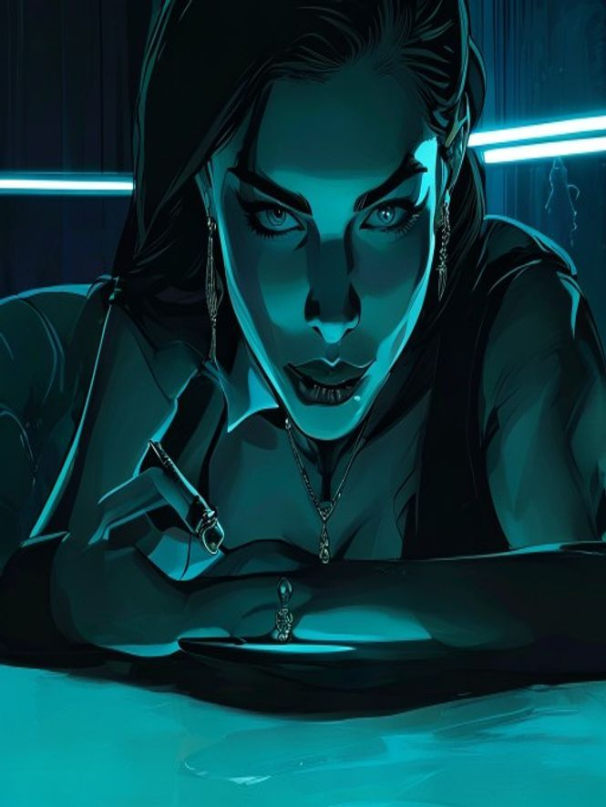
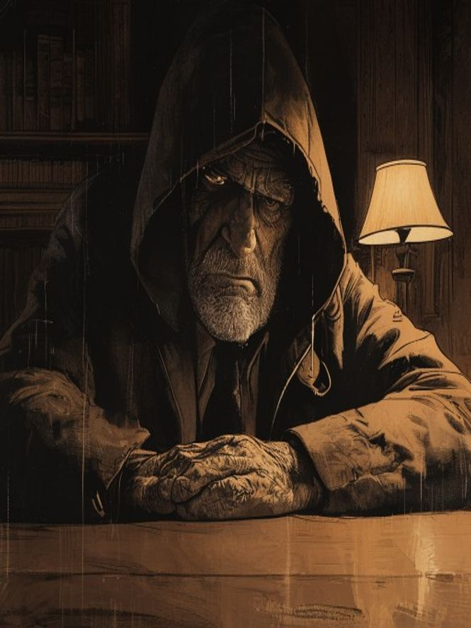
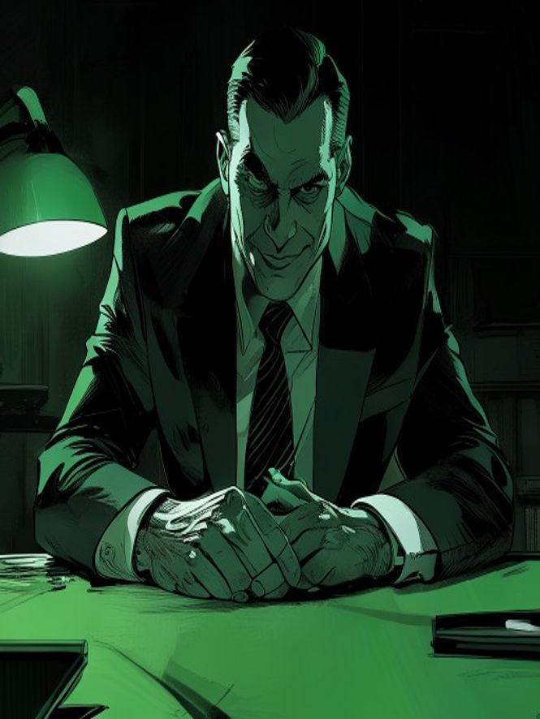
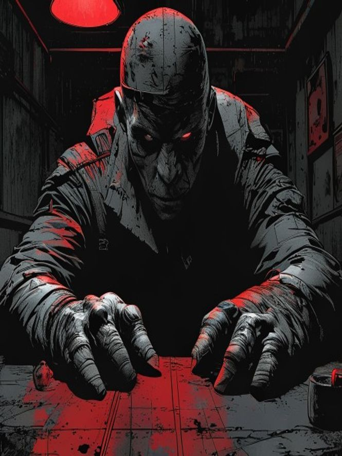

# Negotiator — Noir reboot (concept)

Rebooted 2026-07-15. A **manipulation duel** game: you read, break, scheme and
manipulate one person at a time across a table — reading their mood, deducing their
hidden agenda, finding their personality levers — inside a noir crime story with a
clear end goal.

- **Core:** the duel. Mostly cold/calculated, with hot pressure-spikes (a tell flashes, react in a beat).
- **The opponent (deep, not a menu):** a personality type with levers + a hidden agenda to deduce + a live emotional state you push around.
- **Reading them:** subtext in the writing + a stylized face that reacts live.
- **Your move (two layers):** pick the angle, then the exact words — a read/gamble at each.
- **Look:** "living crime graphic-novel" — bold, high-contrast, cinematic art that moves.

## The duel screen (UI mockup)

*One screen: the opponent you're reading (mood, composure, a live tell), his loaded line,
and your two-layer move — angle → the actual words, each with a risk read.*

## Opponent look — flavor range

Same visual language, different types + palettes:

| | | |
|---|---|---|
|  **the dangerous one** |  **the proud boss** |  **the cornered one** |
|  **the femme fatale** |  **the old kingpin** |  **the slick fixer** |
|  **the enforcer** | | |

Style tests — not final characters. Confirming the *look* before building anything.
