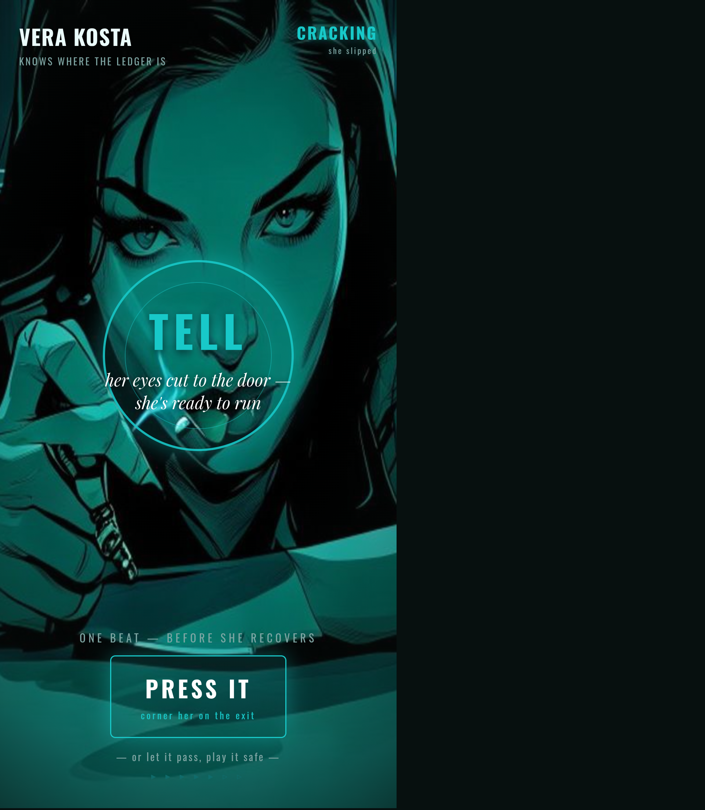
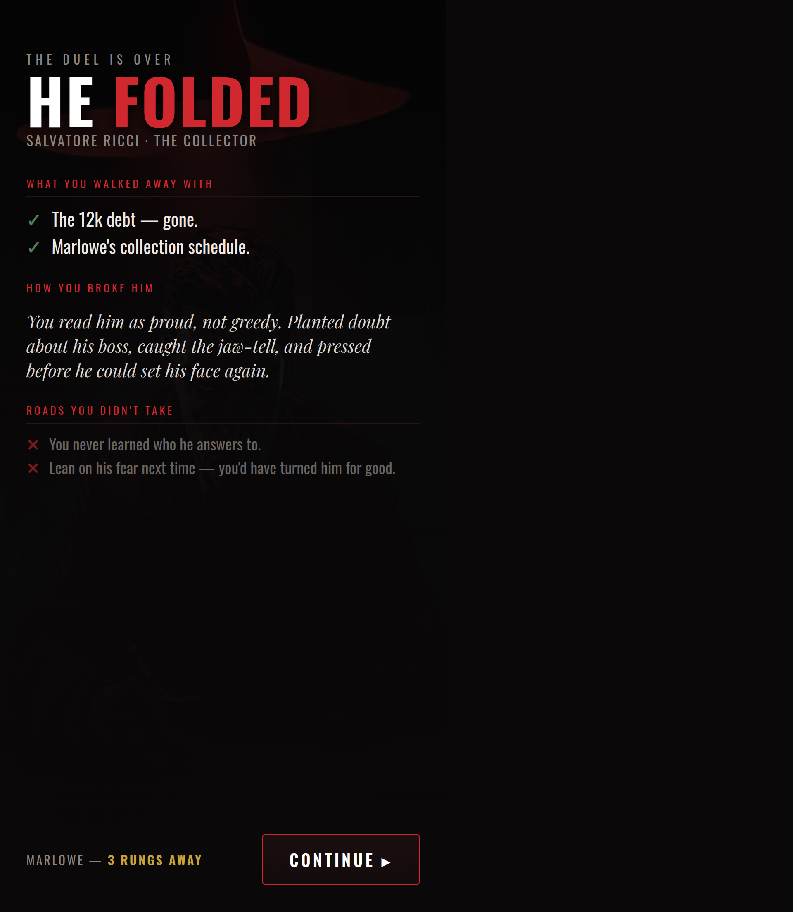
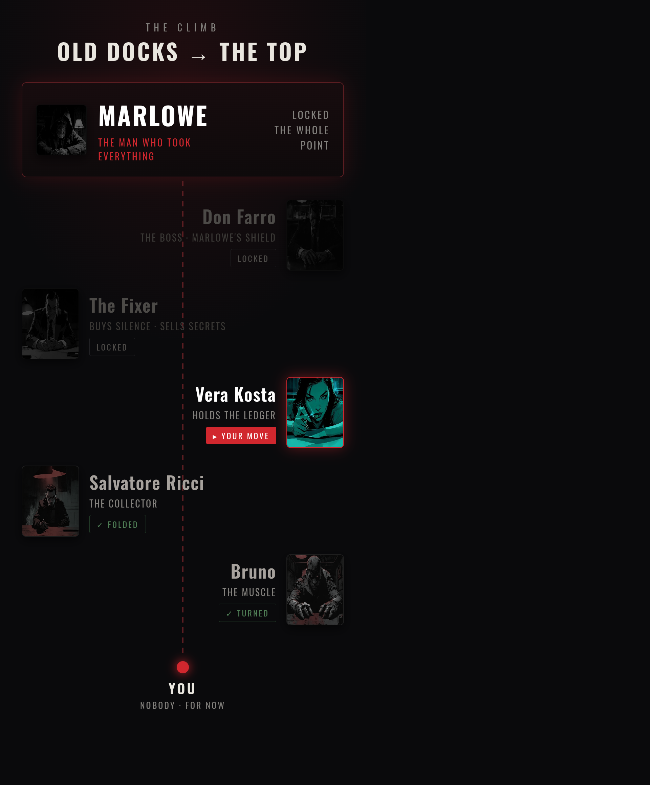

# Screen mockups — the whole game feel

Static mockups (real layout, placeholder content) so the UI can be judged before building.

## 1 · The duel (your move)

Opponent you're reading (mood, composure, live tell) + your two-layer move: angle → the words, each with a risk read. Crimson flavor.

## 2 · The hot spike (a tell cracks)

Mostly it's cold and calculated — then a tell bursts and you get **one beat**: press it or let it pass. Note the whole screen is **teal** — this opponent's lighting palette drives the UI accent too.

## 3 · The aftermath

What you won, *how* you broke them (your read, named back to you), and the roads you didn't take — the replay pull. The goal creeps closer.

## 4 · The climb (the end goal)

You always see the mountain. From YOU at the bottom to **Marlowe** at the top — folded, turned, your-move, locked. This is the "going through a story toward an end goal" spine.
