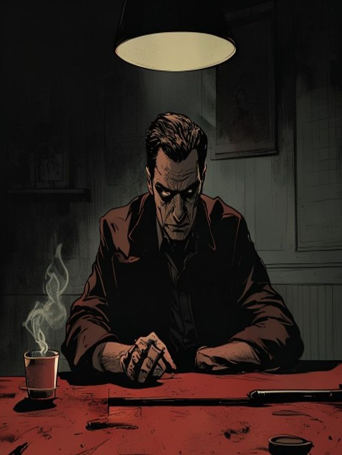
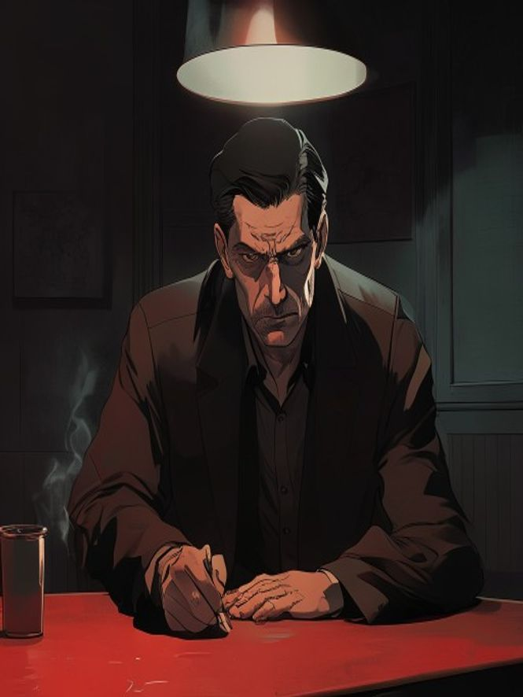
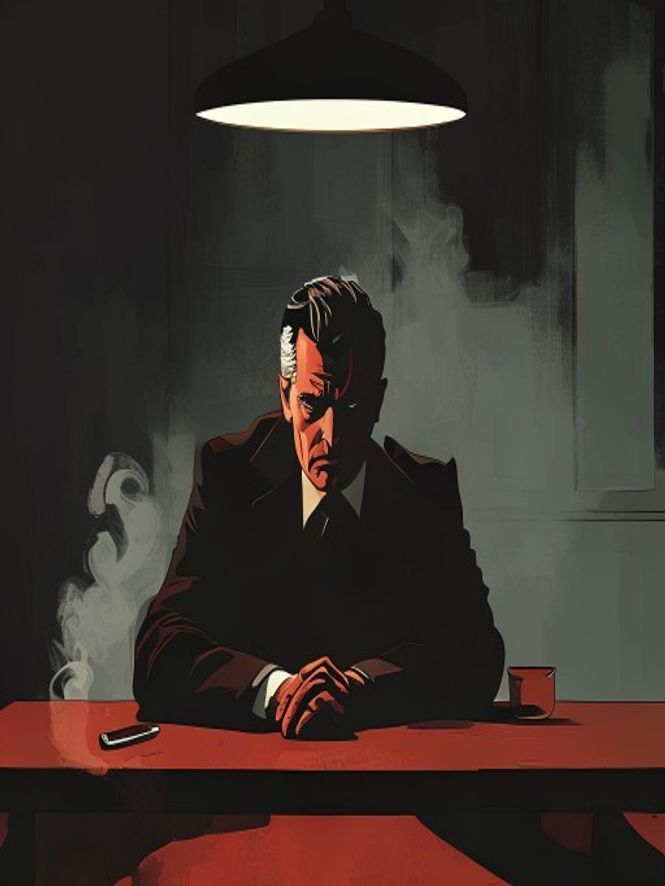
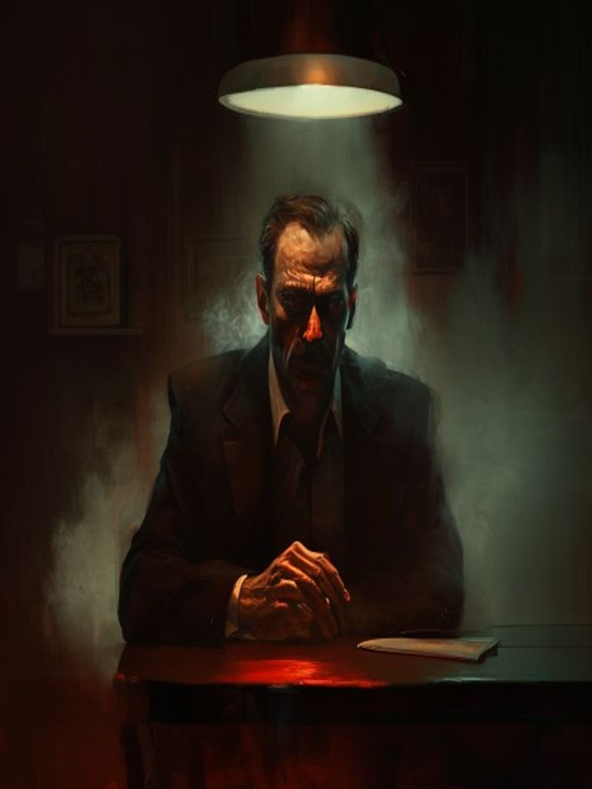
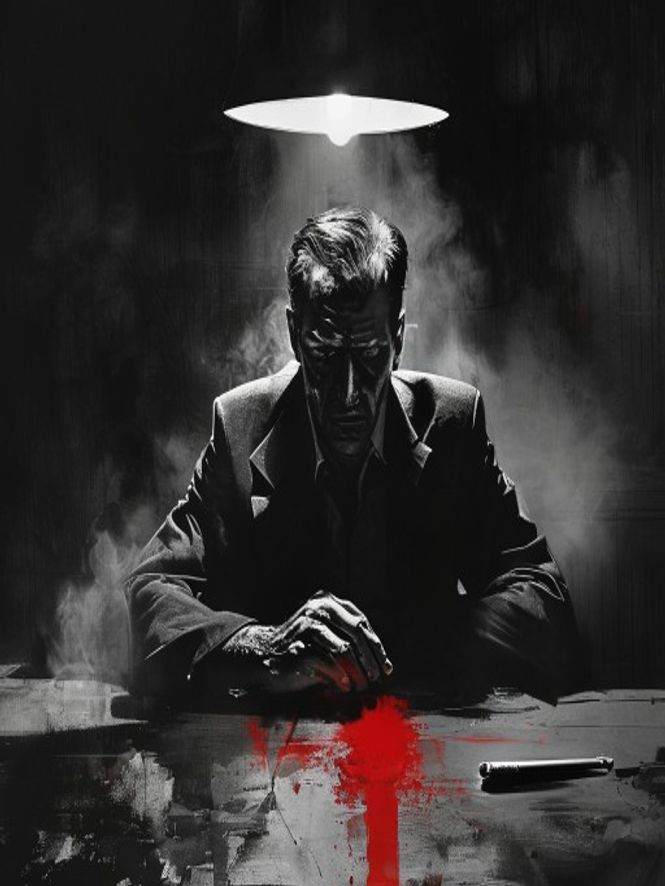
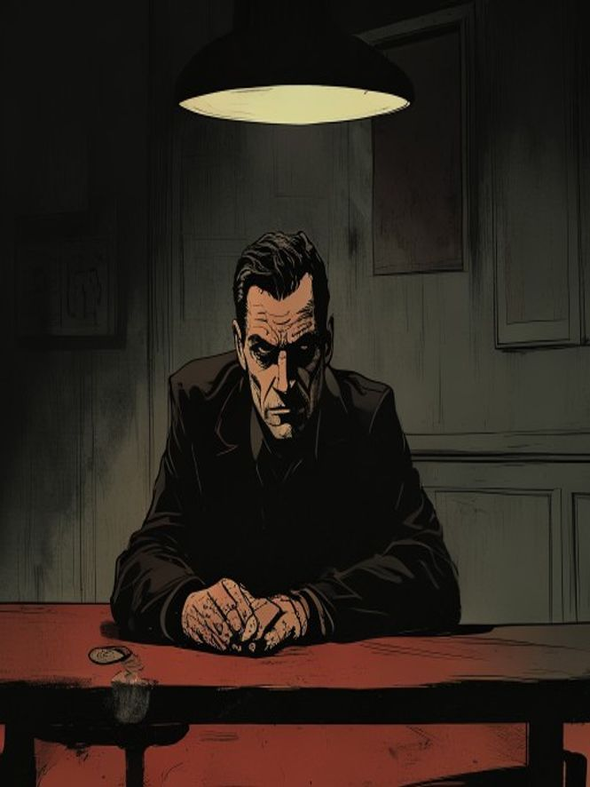

# Art-style board

The **same opponent, same framing**, six ways — so the finish is a real choice.

| | |
|---|---|
|  **1 · Bold comic ink** — heavy black line, flat cel, hard shadow. Classic crime graphic-novel. *(the current direction)* |  **2 · Glossy cel / manhwa-noir** — smoother, premium, sharp eyes. Webtoon polish with noir mood. |
|  **3 · Flat vector poster** — bold shapes, minimal, screenprint. Stylish, iconic, very cheap to animate. |  **4 · Cinematic painting** — semi-realistic, atmospheric, film-still. The "more realistic" end. |
|  **5 · Sin City B&W + red** — brutal black/white, one blood-red hit. Iconic, dramatic, striking. |  **6 · Ligne claire (BD)** — clean thin lines, flat muted color. European crime comic, understated. |

**My lean:** **1 (bold ink)** or **2 (glossy cel)** for the everyday look — both read premium and animate well — with **5 (Sin City B&W+red)** held in reserve for big dramatic beats (a murder, a betrayal, the Marlowe reveal). But your eye decides.
