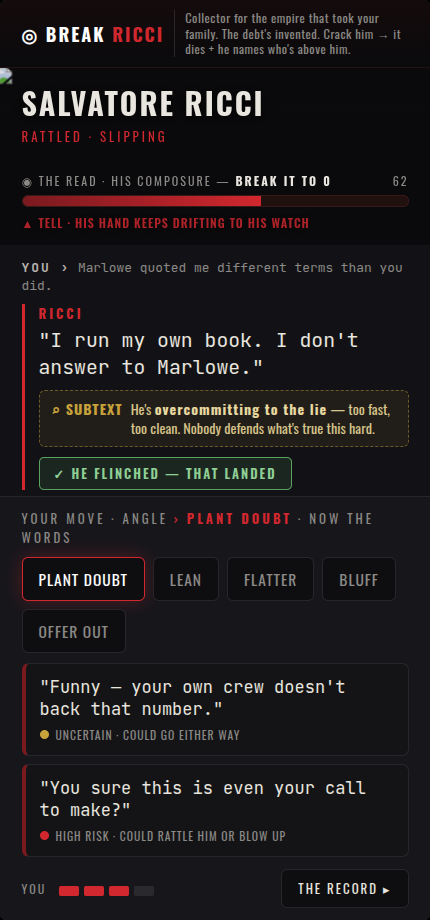

# Redesigned duel screen (v2) — addressing the v0.1.1 feedback

Every info type now has its own place:
- **◎ OBJECTIVE (top):** what you're doing + why (the story/stakes) — always visible.
- **Face + mood:** who + his emotion (animated: breathing, reacts).
- **◉ THE READ:** his composure (the target — break to 0) + a live **▲ TELL** (pulsing). The analytical read, clearly its own zone.
- **CONVERSATION:** labeled **YOU ›** vs **RICCI:** — read the exchange.
- **⌕ SUBTEXT:** a distinct amber box — what he's *really* doing beneath the words.
- **✓ verdict (inline):** he flinched / brushed off / backfired — no separate screen, no flow break.
- **YOUR MOVE:** angle → words, clearly the action zone.

Also: responsive (clamp/flex, fits any screen) + safe-area insets, more animation, no rushed timer.
