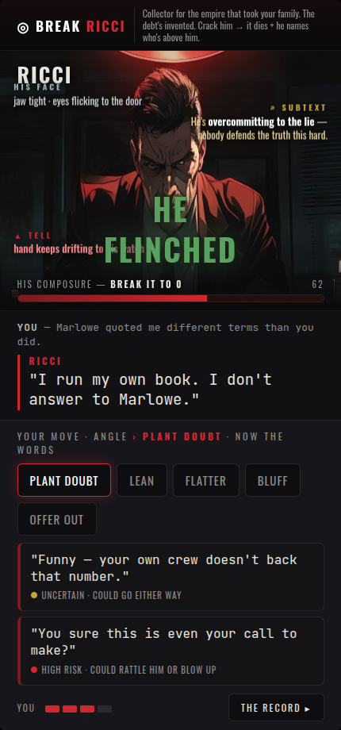

# Duel screen v3 — reads float in the scene, dialogue stays clean

- **Conversation section = ONLY the dialogue** (YOU / RICCI). Clean, readable.
- **In the scene, floating in the air around him:**
  - his **expression** (top-left) — "jaw tight · eyes flicking to the door"
  - the **⌕ subtext** (upper-right, amber) — what he's really doing
  - the **▲ tell** (lower-left, crimson, pulsing) — a live read
  - the **verdict** (center, green) — "HE FLINCHED" — pops on your move, then fades
  - **his composure** bar pinned to the scene bottom (the target)
- Objective always up top. Your move down bottom. Responsive + safe-area + animated.

Note: in the live build the *verdict* is transient (pops on a probe, fades) so it won't sit over the tell like the static shot shows — the persistent floats (expression/subtext/tell) breathe in place.
