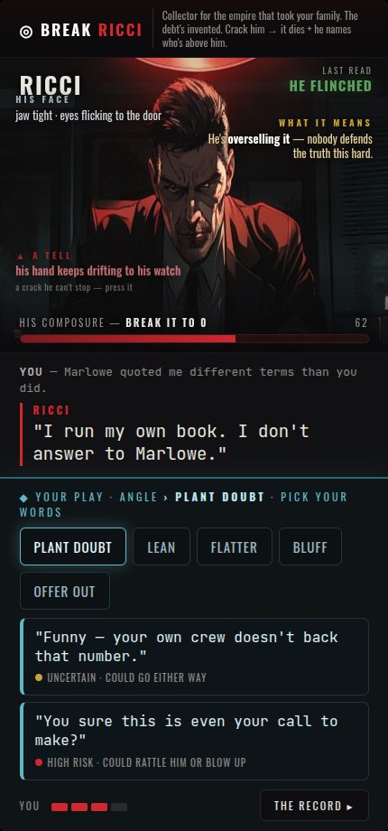

# Duel screen v4 — his voice vs your arsenal, plain-language reads

**His side = crimson.** Dialogue in the conversation strip (RICCI, his voice) + reads floating around him.
**Your side = cool steel.** "YOUR PLAY" — angles + words, visually your arsenal, not his words.

- **Verdict** ("HE FLINCHED") docks small top-right as "LAST READ." In-build it punches out toward you, fades at max zoom, then shrinks and settles there.
- **No jargon dumped on you:** reads are plain — "what it means: he's overselling it…", "a tell: his hand keeps drifting to his watch — a crack he can't stop, press it." The game teaches "tell" the first time.
- Conversation = only dialogue. Reads float in the scene. Objective up top. Steel move zone down bottom. Responsive + safe-area + animated.
