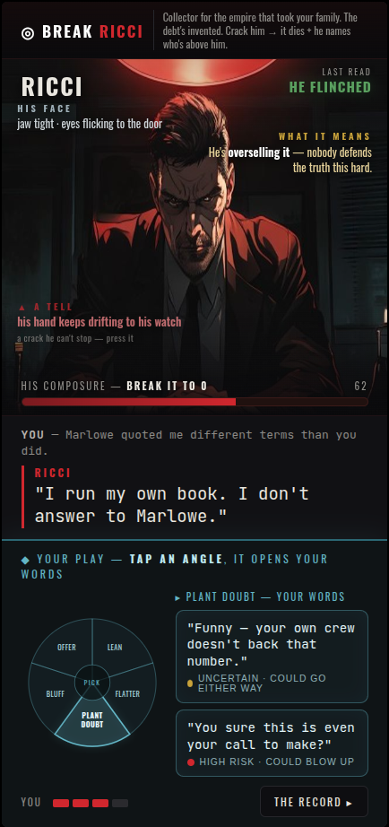

# Duel screen v5 — the angle DIAL (your idea)

The cluttered chips+cards are gone. Your move zone is now a **HUD**:
- A **transparent cyan segmented dial** — each wedge an angle (Lean / Flatter / Plant Doubt / Bluff / Offer). "PICK" hub in the center.
- **Tap a wedge → it opens a HUD panel of your words** (transparent cyan rows, each with its risk read).
- All of it in cool steel/cyan — clearly **your arsenal**, distinct from his crimson dialogue.

Rest unchanged from v4: reads float around him (plain language), verdict docks top-right (punch-out animation in build), conversation = dialogue only, objective up top, responsive + safe-area + animated.
