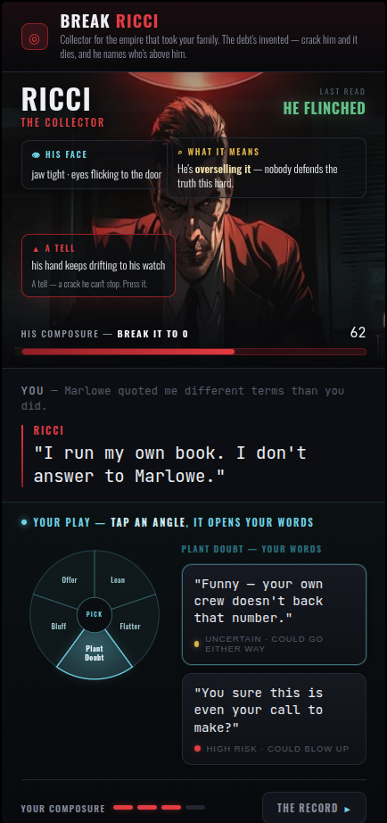

# Duel screen v6 — professional polish pass

Same structure as v5 (approved) — the CRAFT leveled up to a premium-indie-noir bar:
- **Reads are designed HUD tags now** — glass cards, hairline borders, colored labels (👁 his face / ⌕ what it means / ▲ a tell + teach) — not floating debug text.
- **No collisions** — clean nameplate (RICCI / the collector), reads positioned deliberately.
- **Refined everything** — type hierarchy + tracking, consistent spacing rhythm, subtle gradients + depth, a glowing gradient dial wedge, a proper composure meter, refined word cards, a designed objective badge, restrained neon glow.
- Warm crimson (him) vs cool steel (you) held throughout.
