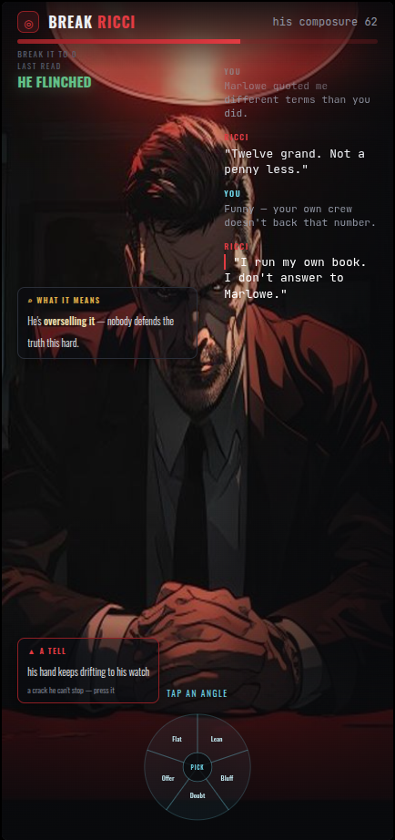
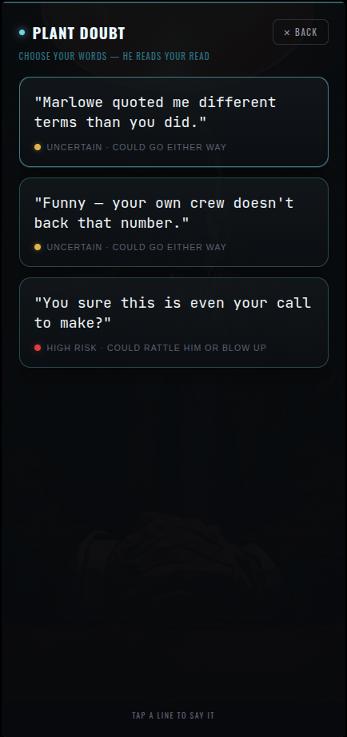

# Duel v7 — cinematic scene + animated flow

## State A — the resting scene

Full scene (him at the table, background visible). Conversation scrolls down the RIGHT (bg shows through). Subtext + tell float in the corners (smaller than dialogue). Verdict docked top-left. Small glassy dial at the bottom — doesn't cover the screen.

## State B — tap the dial → the words

The word options animate up as a full-screen glassy scrollable overlay over the dimmed scene. Tap a line to say it; it closes.

## The animated flow (built in code)
1. Tap the dial → word overlay slides up (B).
2. Pick a line → overlay closes → your line animates into the conversation (right column).
3. **Cut to him**: he fills the screen, his reply **typewriters out at the bottom**, then settles up into the conversation.
4. Reads (subtext/tell) update in the corners; **verdict punches out of the screen → fades → docks in a corner** (you've read the situation).

Note: needs a wider "at the table" framing of the character than the current face crop — an art regen.
