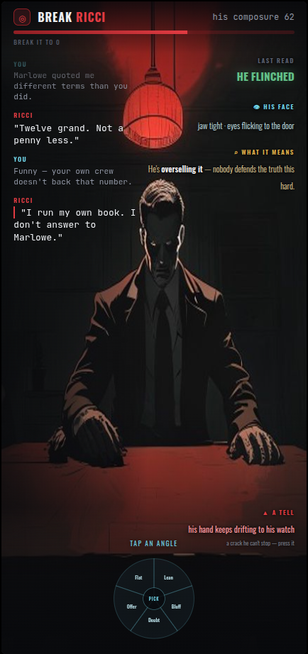
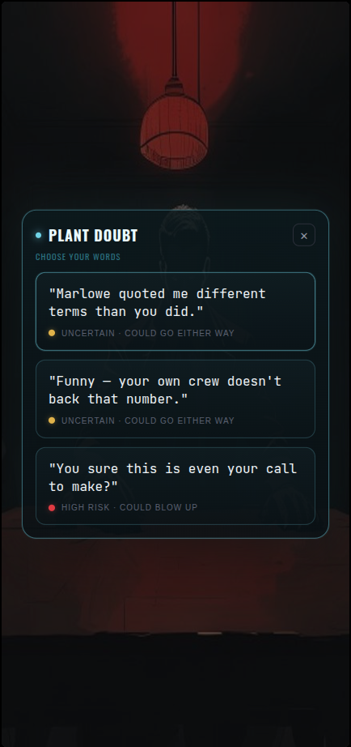
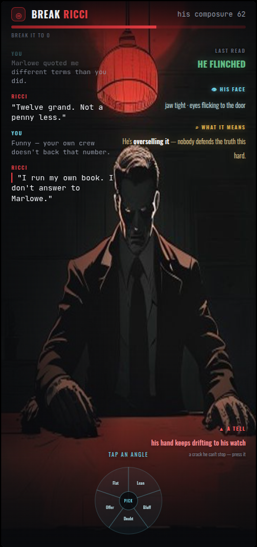
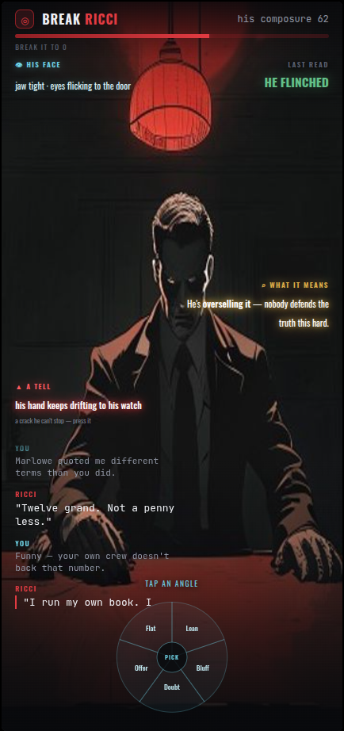
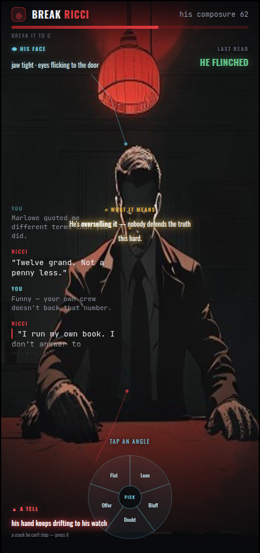
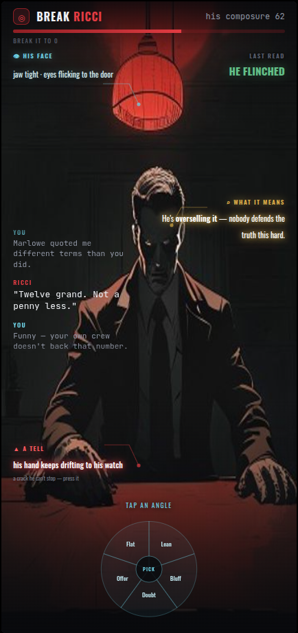
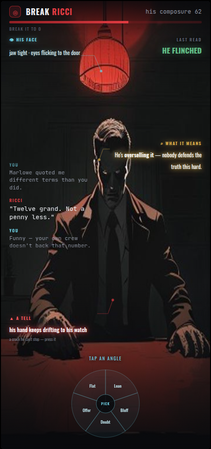
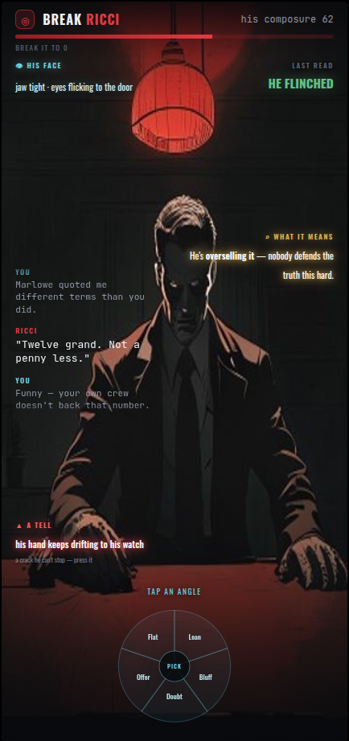

# Duel v8 — cinematic scene, refined

## State A — resting scene

Wide shot (him farther, across the table, full room). **Conversation on the LEFT** (scrollable, bg visible). **Reads float in the air on the RIGHT — no boxes, each in its own colour** (green verdict · steel face · gold subtext · crimson tell), smaller than the dialogue. Small glassy dial at the bottom.

## State B — the words (modal popup, not a separate screen)

Tap the dial → a **glassy-cyan modal** pops up ON the scene (scene visible around it), scrollable words. Tap one → it closes.

## The animated flow (built in code)
Tap dial → modal pops up → pick a line → modal closes, your line flies into the LEFT conversation → **cut to him, his reply typewriters at the bottom then settles into the log** → reads update on the right → **verdict punches out of the screen → fades → docks in the corner.**

---
## v9 tweak — closer + glowing reads

Character pulled a bit closer; subtext (gold) and tell (crimson) now **glow in their own colour** so they pop off the scene.

---
## v10 — scattered reads, white+neon glow, defined convo, bigger dial

Reads scattered (face TL · last-read TR · subtext MR · tell ML). Subtext = **white text, yellow neon**; tell = **white text, red neon**. Conversation = defined limited area, no border, scrollable. Dial bigger, splash clipped inside the wheel.

---
## v11 — annotation lines + final scatter

Conversation centred on the left (nothing beside it). Subtext just below his face; tell at the bottom (clear of the dial). Subtle **annotation lines** angle from each read to his body (steel→face, yellow→chin, red→hands), ending in a small colour-matched dot. No line on last-read.

---
## v12 — straight-then-bend lines, reads on the sides

Annotation lines start straight (H/V) then bend a little, kept short. Reads hug the screen sides (face TL · last-read TR · subtext R · tell lower-L); nothing beside the dial or the conversation box.

---
## v13 — annotation lines exit the box border, point outward

Each line originates at the read-box border and points away toward him (left-box→right, right-box→left, bottom→up, top→down), short, stopping short of the body.

---
## v14 — FINAL State A (lines removed)

Annotation lines removed. Clean cinematic scene: full background, reads on the sides (face TL · last-read TR · subtext R white/yellow-neon · tell lower-L white/red-neon), conversation centred left, glassy dial bottom. This is the build target for State A.
